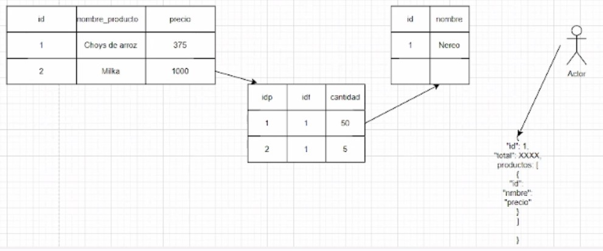

### **Base de Datos II (IC4302)** – Semestre 2, 2023
### **Apuntes 3** – Clase 22-9-2023
### David Suárez Acosta – 2020038304
____

**Atomicidad**

Todas las operaciones en una secuencia se realizan de forma correcta.

Cuando se tiene un recurso compartido, este se tiene que proteger. Cuando todas las transacciones quiere usar un recurso compartido, estas ejecutan una operación atómica de arquitectura llamada *lock* que solo permite una transacción a la vez, es decir serialización.

- *Statements*
- *Power Failure*
- *Errors*
- *Transaction*

**Consistencia**

- En una transacción se pasa de un estado *valid* a otro estado valid, si se va al mismo estado valid que se empezó, esto se llama un *rollback*.
- No se pueden permitir inconsistencias en los datos y esto se logra con SQL fuertemente tipado.
- *Integridad referencial* 

- *Rollback*
- *Triggers*

**Aislamiento de transacciones**

Se tiene que garantizar que dos o más transacciones se corran simultaneamente sin que haya interferencia entre ellas.

- *Control de concurrencia*: hasta que momento se soporta compartir recursos.
- *Transacciones paralelas*

**Durabilidad**

Si se logra correr una transación atómicamente, se respeta la consistencia y se garantiza el aislamiento, se guarda el estado del dato almacenado tiene que irse a disco para que sea persistente.

**Locking**

Los *Exclusive lock* y *Shared lock* tienen que tener un *overhead* y un *blocking* para asegurar que se cumplan bien las transacciones.

Existen dos fases de locking:

1. *Expansión*: se piden todos los locks que se van a necesitar y no se libera ninguno.
2. *Shrinking*: se utilizan los recursos compartidos y se van liberando los locks conforme se van dejando de usar, no se pueden pedir más locks.

No se pueden agarrar más locks una vez que ya se liberaron porque esto puede causar *deadlocks*.

*Conservative two phase locking*: se van liberando conforme se dejan de usar.

*Strict two phase locking*: se liberan los locks de escritura cuando termina la transacción y los de lectura se van liberando cuando se van dejando de usar.

*Strong strict two phase locking*: se liberan todo al final.

**Multi-versión**

A nivel de campos de bases de datos, se manejan múltiples versiones de los datos almacenados.