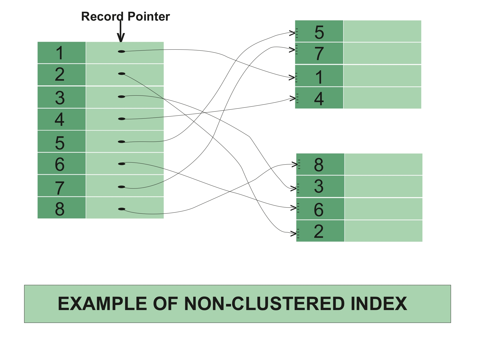
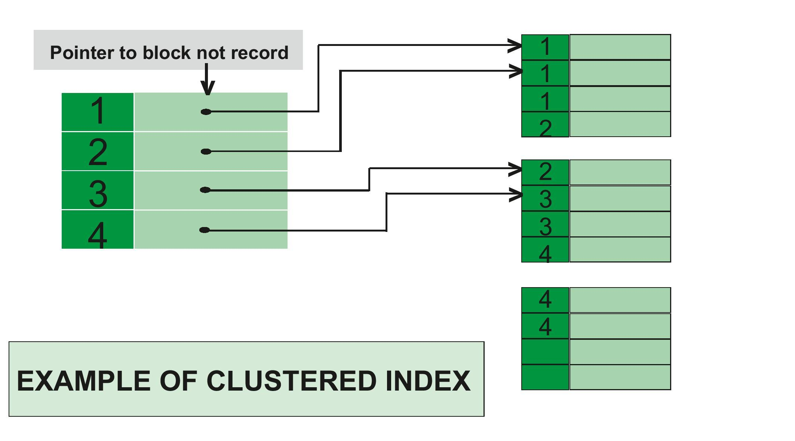

### **Base de Datos II (IC4302)** – Semestre 2, 2023
### **Apuntes 4** – Clase 10-10-2023
### David Suárez Acosta – 2020038304
____

Tenemos un disco que almacena "raw data", estos datos pasan por una transformación que puede ser una normalización o limpieza de datos (depuración de datos erróneos).

En una base de datos SQL el raw data transformado se almacena en tablas. Una *Scan* consiste en la busqueda de un dato específico analizando dato por dato en dichas tablas de la base de datos.

Los *índices* en una base de datos son estructuras balanceadas (como un árbol) que aumentan la velocidad de operaciones como búsquedas de datos, esto se logra por medio de identificadores en cada row de la tabla. Existen los *Non Clustered Index* y *Clustered Index*.

**Non Clustered Index**

Estos índices tienen una estructura separada de los rows de datos y contienen los "key values" del índice así como un puntero al raw data contenido por los key values.

En un Non Clustered Index hay un *Header* que contiene metadatos, el más importante siendo el *head*. Cuando este head = -1 significa que no hay datos en la base de datos. También existe el metadato *start* que indica donde inician los datos.

La principal diferencia con los Clustered Index es que los Non Clustered Index son una estructura separada a los datos, como se muestra en la siguiente imagen:

En resumen, un Clustered Index es una estructura separada a los datos que tiene punteros hacia los datos para aumentar la velocidad de acceso a dichos datos.

**Clustered Index**

Estos índices ordenan y almacenan los rows de datos en las tablas basado en sus key values. Solo existe un Clustered Index por tabla.

En la siguiente imagen, se muestra el funcionamiento del Clustered Index:

En resumen, los Clustered Index son una reacomodación de los datos en una tabla para que sea más rápida la lectura de datos, ya que ya se conoce el orden de estos.

Todo índice usa memoria y disco, hay que intentar que el Non Clustered Index sea lo suficientemente pequeño para que se guarde completo en memoria.

**Hash Index**

Es la creación de una columna que contiene valores únicos de las tablas, como primary keys, y luego pasan por una función de hash que acomoda los datos. 

Hay que saber como escoger esta función de hash para que el orden de los datos mejore la velocidad de acceso.

**Partial Index**

Los índices parciales solo indexan los datos que cumplen con cierta condición establecida. Esta condición permite que sean rápidos y pequeños, ya que no se indexan todos los datos.

**Fuentes**

Explicación de Clustered y Non Clustered Indexes:
https://learn.microsoft.com/en-us/sql/relational-databases/indexes/clustered-and-nonclustered-indexes-described?view=sql-server-ver16

Imagenes de Indexes:
https://www.geeksforgeeks.org/difference-between-clustered-and-non-clustered-index/

Explicacion de Hash Index:
https://www.linkedin.com/pulse/part-l-data-structures-databases-hash-index-ahmed-rakan#:~:text=Hash%20indexes%20are%20used%20in,non%2Drelational%20databases%20like%20MongoDB.