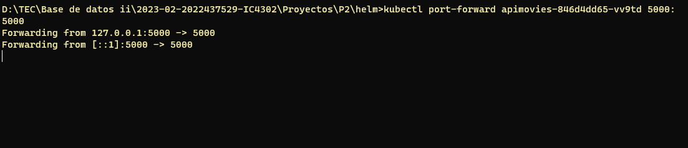

# **Base de Datos II (IC4302)** – Semestre 2, 2023
### **Proyecto 2**  
### Jesús Andrés Cortés Álvarez  – 2021579439
### Aaron Ortiz Jimenez  – 2022437529
### David Suárez Acosta – 2020038304
### Justin Acuña Barrantes -
### Joctan Porras Esquivel -
---
## **Ejecución del proyecto**

En el siguiente proyecto se realizo un buscador de información sobre peliculas, se emplearon dos bases de datos como los son MongoDB Atlas y Neo4j, la información empleada son dataset de pruebas que probee ambos servicios. Además se empleo firebase como herramienta en el manejo de autenticación de los usuarios.

Como primer paso se debe instalar el POD del API en kubernetes, para eso se abre una consola en la carpeta helm del proyecto y se ejecuta el comando presente en la siguiente imagen:

Luego, necesitamos exponer el puerto del pod con la maquina, para eso se ejecuta el siguiente comando en consola expuesta en la siguiente imagen, cabe aclarar de que no se debe cerrar la siguiente ventana para seguir exponiendo el puerto.

Para exponer el puerto a internet utilizaremos la aplicación ngrok, para tal efecto ejecutaremos el siguiente comando en la consola en la carpeta que se encuentre el ejecutable ngrok.exe exponiendo el puerto del anterior paso. De igual forma se debe mantener la ventana abierta.

## **Pruebas unitarias**

En las siguientes imagenes se presentan el codigo realizado en **test.py** donde se realizan las pruebas con las APIs, en las primeras pruebas son realizadas con la sección de MongoDB Atlas, se comprueba en las diferentes rutas que devuelvan de codigo de estado 200, además se verifica que el contenido retornado por el request no sea cero ante los casos de prueba programados. 

