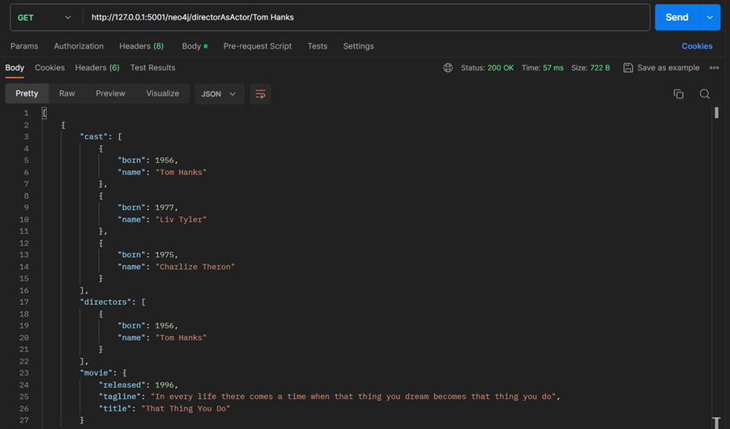

# **Base de Datos II (IC4302)** – Semestre 2, 2023
### **Proyecto 2**  
### Jesús Andrés Cortés Álvarez  – 2021579439
### Aaron Ortiz Jimenez  – 2022437529
### David Suárez Acosta – 2020038304
### Justin Acuña Barrantes - 2018093451
### Joctan Porras Esquivel - 2021069671
---
## **Ejecución del proyecto**

En el siguiente proyecto se realizó un buscador de información sobre películas, para eso se emplearon dos bases de datos como los son MongoDB Atlas y Neo4j, la información empleada son dataset de pruebas que provee ambos servicios. Además, se empleó firebase como herramienta en el manejo de autenticación de los usuarios.

Como primer paso para ejecutar el proyecto se debe instalar el POD del API en kubernetes, para eso se abre una consola en la carpeta helm del proyecto y se ejecuta el comando presente en la siguiente imagen:

Luego, necesitamos exponer el puerto del pod con la máquina, para eso se ejecuta el siguiente comando en consola expuesta en la siguiente imagen, cabe aclarar de que no se debe cerrar la siguiente ventana para seguir exponiendo el puerto.

Para exponer el puerto a internet utilizaremos la aplicación ngrok, para tal efecto ejecutaremos el siguiente comando en consola desde la carpeta donde se encuentre el ejecutable ngrok.exe exponiendo el puerto del anterior paso. De igual forma se debe mantener la ventana abierta.

La interfaz fue creada con la plataforma Thunkable, para eso se crearon varias páginas para implementar las funcionalidades pedidas. Primero accedemos a la cuenta donde se creó el proyecto, cuando accedemo al sitio tenemos la página de Login donde se introduce el correo y la contraseña que este registrada. En caso de que el correo o contraseña no estén registradas, o no cumpla con el largo de 6 palabras en la contraseña, o deje los espacios en blanco mostrara un mensaje de error. Si los datos están correctos y presiona login, pasa a la siguiente página. Por otro lado, si se presiona: “Register now!” pasamos a la página de registro. 

En la página de registro tenemos que introducir un correo no registrado, contraseña y re-digitar la contraseña para confirmar, al presionar el botón “Register” creamos un nuevo usuario con el que podamos acceder a la app si los datos son correctos, en el caso contrario de que no cumpla con el largo de 6 palabras en la contraseña, o se deje un espacio en blanco mostrara un mensaje de error.

Luego de acceder al sistema, se muestran las dos bases de datos con las cuales puede seleccionar uno para realizar la búsqueda, o cerrar sesión con el botón que se encuentra al final de la página.  

Luego de seleccionar una base de datos, se mostrará un menú en donde podrás seleccionar búsqueda general al presionar el botón "Search a Movie", por otro lado, al presionar "Advanced Search" se mostrará la página para búsqueda avanzada.

Al presionar "Search a Movie" muestra la siguiente pantalla donde tenemos un textbox donde podremos agregar un valor de búsqueda general ya sea el título, nombre de un actor, director o plot. Si queremos volver a la página anterior se presiona "Back Menú".

Al introducir un valor de búsqueda y presionar el botón “search” se desplegarán los documentos con sus datos obtenidos de la búsqueda con el motor de base de datos empleado, al presionar el campo del documento se puede acceder a todos los datos. 

En el caso de que la búsqueda devuelva muchos resultados se habilitaran las flechas para mostrar los demás documentos.

Cuando se accede a un documento se redirige a la página que se aprecia en la siguiente imagen, donde muestra todos los datos que contiene el documento.

Si presionamos el bóton "Advanced Search" entramos a la página de advanced search donde tenemos dos campos de entrada uno para buscar por actor y otro para director, aparte se tienen las opciones para realizar la busqueda de las peliculas donde el actor o director actua o dirigen.

Si seleccionamos alguna de las opciones del menú de Advanced Search se nos mostraran las peliculas resultante con el criterio definido.

Si al realizar una busqueda de un valor que no coincide con los datos almacenados en la base de datos se mostrara un mensaje de error.

## Pruebas Realizadas
Para probar las diferentes rutas de la api se empleo la herramienta postman, empleada en experiencias pasadas. Para ejecutar el programa necesitamos realizar los pasos de la sección pasada en especial exponer el pod en un puerto de la maquina. Luego de realizar eso nada más agregamos la ruta en la entrada, seleccionamos el metodo que definimos, agregamos el valor de busqueda y le damos al boton **Send**. A continuación se muestran las diferentes pruebas en el caso de Mongo.

https://musical-kite-probably.ngrok-free.app/mongo/search/\<valor\>: Búsqueda de películas general en los documentos.

https://musical-kite-probably.ngrok-free.app/mongo/pelicula/\<valor\>:   Búsqueda de películas donde devuelve todos el contenido del documento.

https://musical-kite-probably.ngrok-free.app/mongo/searchDirector/\<valor\>: Búsqueda de películas donde la persona dirige.

https://musical-kite-probably.ngrok-free.app/mongo/searchCast/\<valor\>: Búsqueda de películas donde la persona actúa.

---
Para Neo4j tenemos las siguientes pruebas desde Postman, donde se muestran los resultados con sus diferentes rutas con su pequeña descripción sobre su función.

https://musical-kite-probably.ngrok-free.app/neo4j/search\<valor\>: búsqueda general en los documentos.

https://musical-kite-probably.ngrok-free.app/neo4j/castAsActor/\<valor\>: Búsqueda de películas donde el actor actúa.	

https://musical-kite-probably.ngrok-free.app/neo4j/castAsDirector/\<valor\>: Búsqueda de película donde el actor dirige.

https://musical-kite-probably.ngrok-free.app/neo4j/directorAsDirector/\<valor\>: Búsqueda de películas donde el director dirige.

https://musical-kite-probably.ngrok-free.app/neo4j/directorAsActor/\<valor\>: Búsqueda de películas donde el director actúa.

---
## Mapping

Para emplear un índice de búsqueda en Mongo Atlas se realizó el siguiente mapeo, donde se definieron los campos cast, directors, plot, title. Para mejorar las búsquedas por cada palabra se definió cada campo como string para emplear el analizador de textos, además, ya que son los campos donde se realizan más búsquedas y que sean más precisas. En la siguiente imagen vemos la estructuras del mapping.

## **Pruebas unitarias**

En las siguientes imagenes se presentan el codigo realizado en **test.py** donde se realizan las pruebas con las APIs. En las primeras pruebas son realizadas con la sección de MongoDB Atlas, comprobando que las diferentes rutas devuelvan codigo de estado igual a 200 que significa que el request fue exitoso, además se verifica que el contenido retornado por el request no sea cero ante los casos de prueba programados. El codigo podemos apreciarlo en la siguiente imagen.

El resultado lo podemos observar en la imagen de abajo:

En el caso de Neo4j, se realizan pruebas entre las diferentes rutas comprobando que cada request devuelva de Código de estado igual a 200. El código es el siguiente:

El resultado lo apreciamos en la siguiente imagen.

## **Conclusiones y Recomendaciones**

- Gracias a experiencias previas empleando el motor de base de datos MongoDB Atlas, se encontró otros operadores que proveen un mejor resultado a las búsquedas, además de poder emplear otras opciones que permite los drivers de Python.

- Aun con lo implementado, la documentación posee una gran variedad de información para mejorar los resultados de búsqueda, recomendamos realizar pruebas con dataset ya cargados por el proveedor y realizar una compresión y emplear las herramientas que aporta Mongo Atlas para comprobar un cual provee un mejor rendimiento.

- El manejo de emplear Thunkable para diseñar la interfaz de usuarios tiene sus puntos interesantes, pero el manejo de bloques se dificulto por un manejo menos libre de las tecnologías empleadas anteriormente.

- Para manejar Thunkable es necesario tener un orden al trabajar las secciones de la aplicación y tener especial cuidado cuando se estan empleando ciclos.

- El uso de Bases de datos fue muy interesante debido a que las consultas tienen una estructura similar a las SQL, pero debido a que las relaciones entre nodos son más explicitas y significativas podemos comprender como se conectan entre estos, tambien fue de mucha utilidad la documentación que tiene Neo4j, la cual contiene muchos ejemplos que fueron de utilidad para realizar las consultas.

- Para futuros desarrollos de proyectos relacionados con neo4j se recomienda el uso de una base de datos local, debido a que en ocasiones la BD demo de peliculas puede no estar disponible, en este caso se utilizó Ne4j desktop el cual brinda una forma sencilla de crear BD de grafos de manera local.

- En el desarrollo de los proyectos nos hemos dado cuenta de que Firebase es una base de datos con la que manejar usuarios se convierte en una tarea bastante sencilla de realizar, tiene una velocidad de respuesta bastante buena y tiene una disponibilidad prácticamente constante, lo que la hace una excelente opción para estas tareas.

- Si en algún momento se tiene la necesidad de hacer un manejo de usuarios para alguna plataforma web o móvil, Firebase es una solución de fácil instalación y muy rápida de poner en marcha, este semestre algunos la hemos usado tanto en proyectos del curso de Bases de Datos como en el curso de Requerimientos por la buena experiencia que tuvimos en el primer proyecto de Bases.

- Para el manejo de observabilidad trabajando on-premise tiene sus dificultades ya que tenemos que configurar todos los elementos que deseamos orquestar, donde nos encontramos muchas trabas.

- Es necesario investigar sobre como lograr orquestar correctamente servicios como lo fue MongoDB Atlas y la aplicación en Python, o buscar soluciones alternativas que sean  más eficientes para realizar su implementación como es Managed Services que provee mayor seguridad, pero con la implicación del costo monetario. 