# **Base de Datos II (IC4302)** – Semestre 2, 2023
### **Tarea Corta #1** 
### Jesús Andrés Cortés Álvarez  – 2021579439
### Aaron Ortiz Jimenez  – 2022437529
### Joctan Antonio Porras Esquivel - 2021069671
### Justin Acuña Barrantes  - 2018093451
### David Suárez Acosta – 2020038304

---

## Instrucciones de funcionamiento

 Para realizar los scripts de cada base de datos es necesario subir la base de datos, en este caso para visualizar su funcionamiento se deberá de ingresar a la carpeta llamada databases, seleccionar el archivo "values.yaml", seguidamente al entrar el archivo el apartado de enabled debe ser cambiado a "true" en el caso de que se encuentre en "false" la base de datos con la que desea trabajar, si alguna de las otra bases de datos se encuentra en "true", se recomienda cambiar a al valor "false", esto para evitar que las de demás bases de datos se ejecuten en simultaneo y únicamente ejecutar la deseada.

 Luego deberá de dirigirse a la carpeta llamada "backups", ingresar al archivo "values.yaml", y realizará de igual forma a como se explicó anteriormente, buscar la base de datos en la cual desea trabajar y coloca en "true" el apartado enabled o en caso opuesto "false", según desee el usuario, de igual forma se recomienda no colocar varias en true el apartado de enabled de las diferentes bases de datos para evitar conflictos.

* **Base de datos Neo4j**

    En la siguiente imagen se presenta el caso de utilizar la base de datos de Neo4j.

  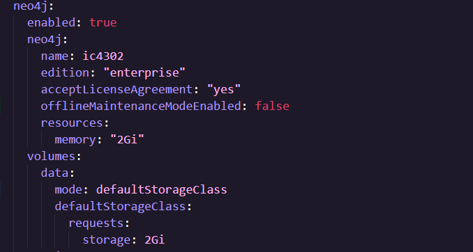

    Para probar el funcionamiento del backup y restore en esta base de datos, deberá hacer una acción similar a la mencionada anteriormente, dependiendo de la accion de backup o restore, colocará true en el espacio señalado, esto para visualizar su funcionamiento.

   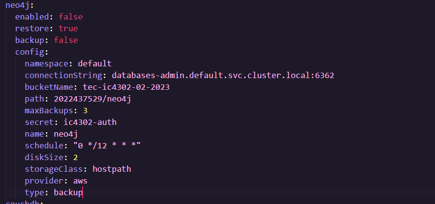

* **Base de datos ElasticSearch**

* **Base de datos Couchdb**

    Para probar el funcionamiento del backup y restore en esta base de datos, deberá hacer una acción similar a la mencionada anteriormente, dependiendo de la acción de backup o restore, colocará true en el espacio señalado, esto para visualizar su funcionamiento.

    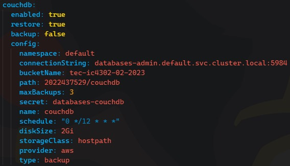

    Seguidamente en una terminal se ejecuta el comando para instalar el Helm chart(Se logra apreciar en la siguiente imagen) y se visualiza como el job seleccionado anteriormente genera el backup o el restore respectivamente, es posible visualizar la ejecución con la herramienta Lens.

    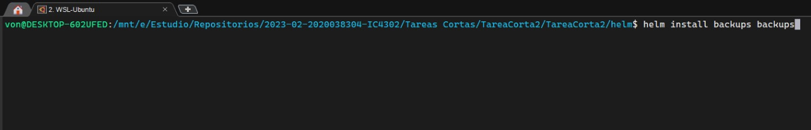

    En la siguiente imagen mediante la aplicación Lens se logra observar que cuando aparece en pantalla la palabra "Succeeded", significa que el job se ejecutó correctamente.

    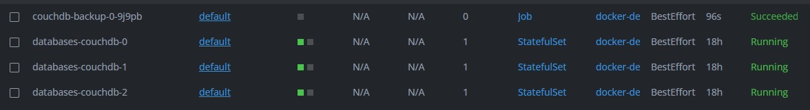

* **Base de datos Postgresql**

    En la siguiente imagen se presenta la creación de la base de datos de Postgresql.

    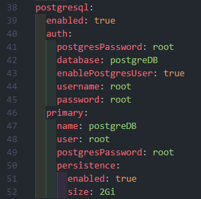

    Como se mencionó al inicio se coloca en true en el apartado de enabled la accion que desea realizar en la base de datos.

    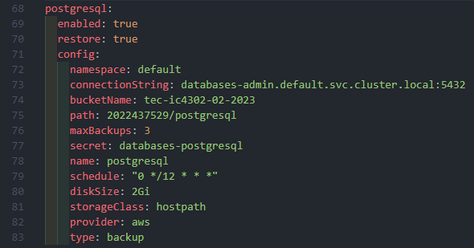

## Pruebas realizadas

* **Base de datos Neo4j**

    A continuación, se presenta como se realizan las pruebas correspondientes para la base de datos de Neo4j.

    

    Se logra observar el resultado del primer script, que obtiene los datos desde el bucket s3 hacia la maquina en la que se está trabajando.

    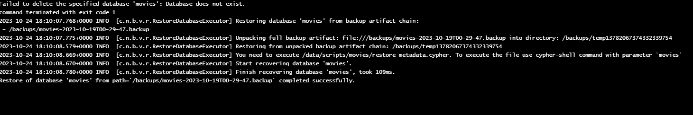

    En la imagen anterior se observa que se completó el proceso para realizar el restore.

* **Base de datos ElasticSearch**

    En las siguientes imágenes se presenta como dirigirse a la sección de snapshot, primero se debe de dirigir al cuadro de "menú" y luego se dirige al espacio de "Stack Managment".
    
    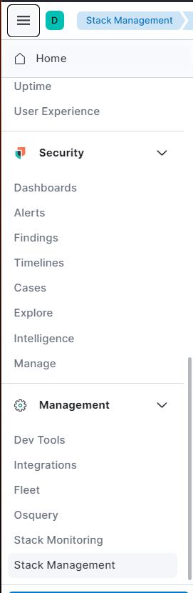

    Al dar clic se le presentará el siguiente menú, donde deberá de dirigirse al apartado de "Snapshot and Restore".

    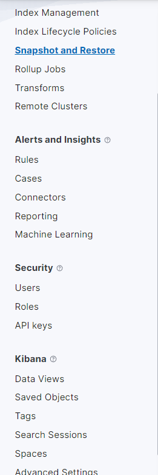

    Seguidamente se presentan imágenes correspondientes a la creación del repositorio, en este caso para la creación se pone de nombre el carnet estudiantil, el servicio seria "aws s3". Para la siguiente imagen, se define el cliente como default, el bucket que fue el asignado y se logra apreciar en la imagen, al finalizar se preciosa el botón de registrar.

    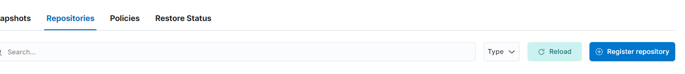

    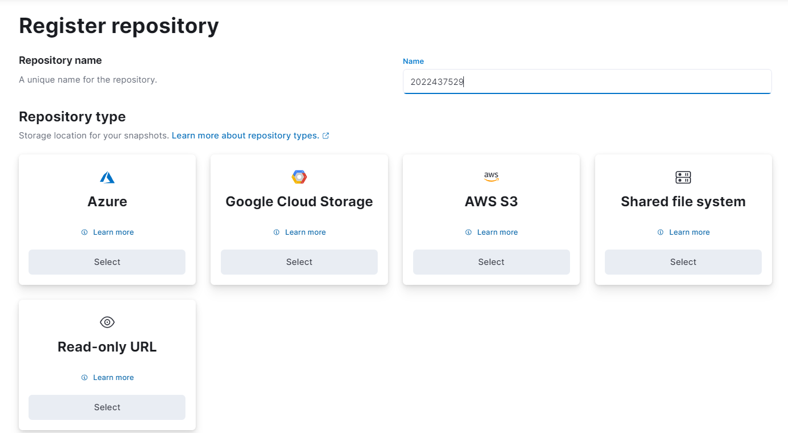

    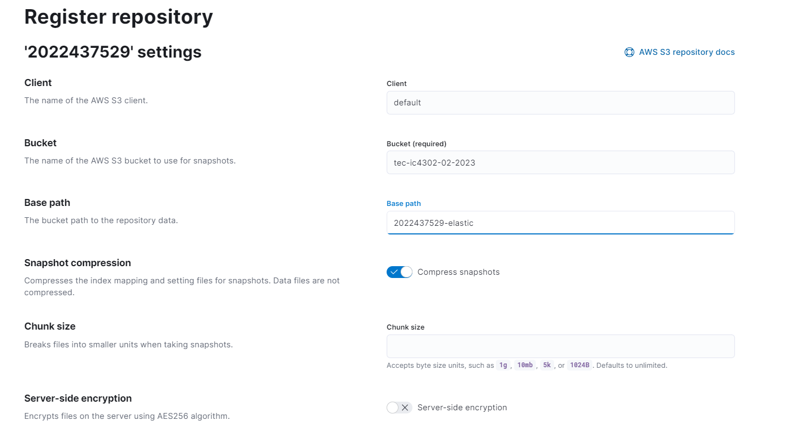

    Para la creación del snapshot, se debe ir al apartado de "Create Policy", se le coloca un nombre, el nombre del snapshot, se asignan las configuraciones que va a tener el snapshot, políticas de retención y la duración, para finalizar se presiona el botón de "Create Policy"

    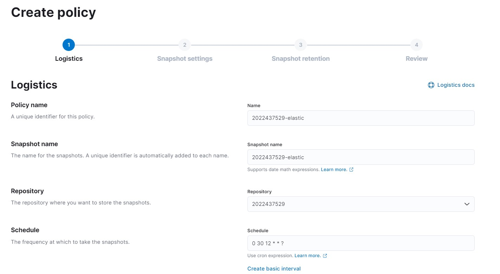

    En la siguiente imagen se observa que ya fue creado el policy, seguidamente se presiona el botón ubicado al lado derecho para correrlo, y ya realizaría el backup, Al finalizar ya aparecerían los snapshots.

    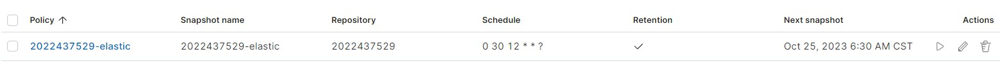

    En la siguiente ya se logra observar la creación de los snapshots de la base de datos.

    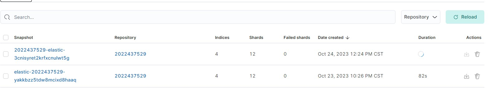

    En el apartado del restore, se debe indicar el índice, donde se desmarca las opciones que no se necesitan para el restore.

    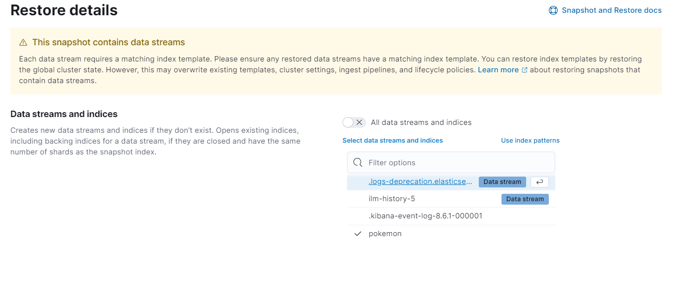

    Se indican las configuraciones necesarias, como se indica en la siguiente imagen.

    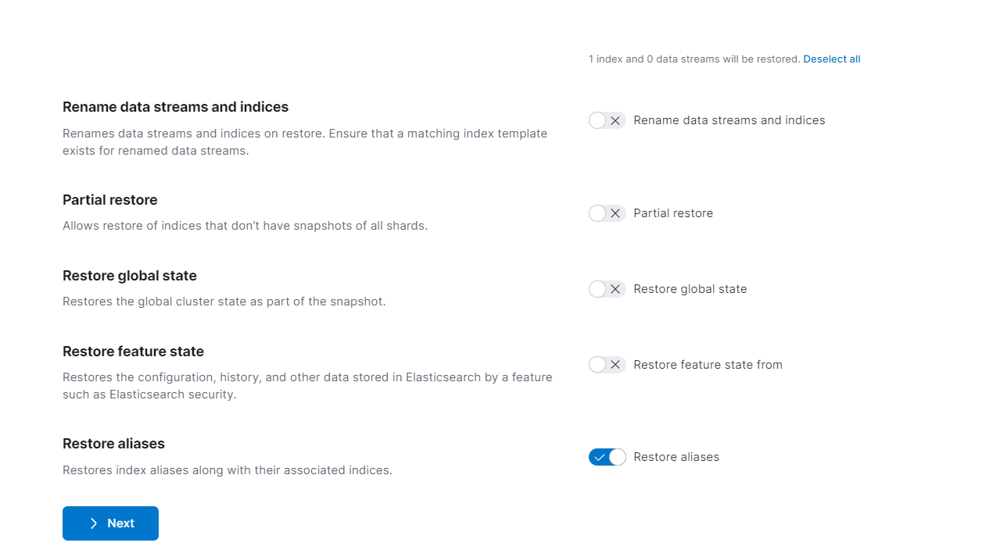

    En la siguiente imagen se verifica que se cumplen las configuraciones mencionadas anteriormente.

    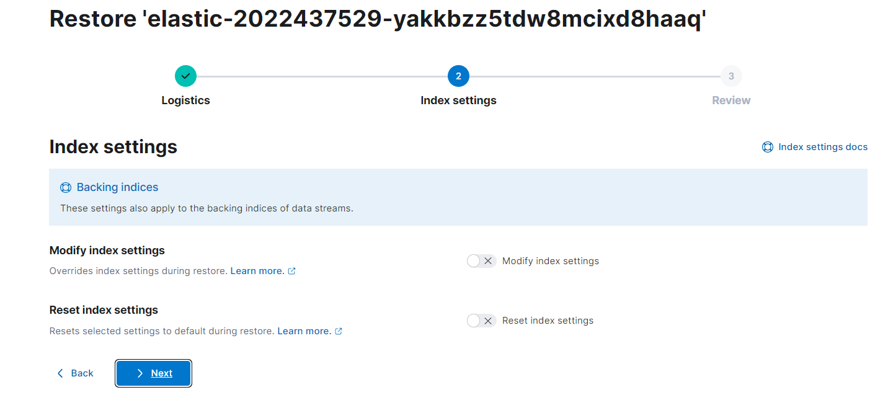

    Cuando se ejecuta el restore, se observa que se completó correctamente la recuperación de los datos.

    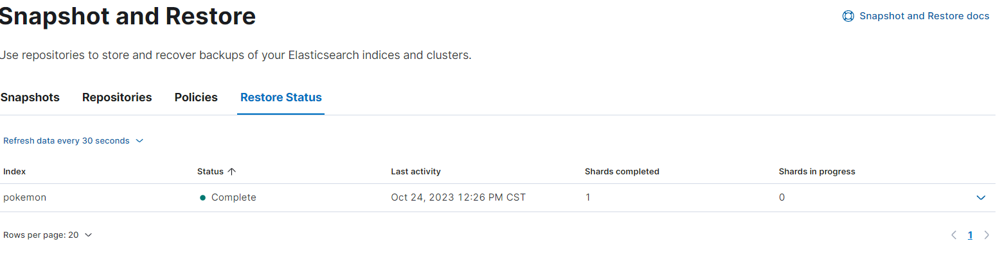

* **Base de datos Couchdb**

    A continuación, se presenta la base de datos que contiene datos de prueba basado en algunas películas.

    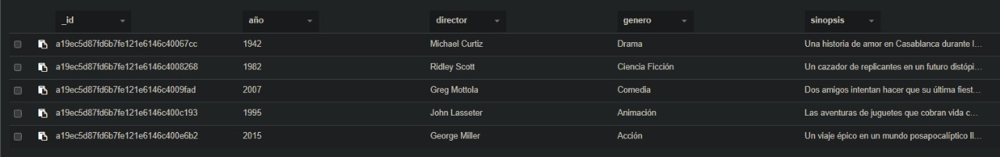

    Seguidamente en la siguiente imagen se presenta la subida del backup al bucket de AWS.

    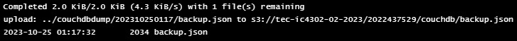

    En la siguiente imagen se presenta la respuesta de la consulta del script para el restore de la base de datos con un caso exitoso. El espacio ok: true indica que el restablecimiento del documento fue exitoso.

    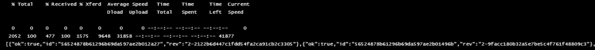

## Recomendaciones

* En el caso de la base de datos de Neo4j, realizar una búsqueda completa en la documentación y emplear las herramientas que posee Neo4j para realizar backups, donde se incluye el Cron Job, en el caso del restore es recomendable utilizar dos contenedores, que obtenga los datos del cloud provider  y otro que ejecute el comando dentro del pod.

* Es recomendable utilizar la herramienta que tiene el propio couch para la administración de la base datos, este se puede encontrar en el endpoint llamado /_utils. Nos permite hacer todas las operaciones CRUD dentro de una interfaz amigable y sin utilizar programas externos.
* En caso de manejo de errores y seguimiento de la ejecución de los scripts, es muy útil observar mediante la herramienta Lens, si ingresamos al job y observamos los logs, se puede realizar un seguimiento necesario para observar el flujo del script.

## Conclusiones

* Como conclusión se observa la importancia de realizar backups y la posibilidad de almacenarlo en diferentes lugares, en nuestro caso en un sistema de cloud.
*  En cuanto a couchdb es muy interesante cómo todas las consultas a la base de datos están implementadas mediante endpoints en una API, esto hace que sea muy sencillo realizar consultas mediante el navegador o una herramienta que posee couch en el endpoint llamado _utils
* Es interesante como se implementan los backups mediante el uso de los propios enpoints de couch, y no es necesario instalar o requerir otras herramientas fuera de las que brinda couch, el backup se realizó solamente usando las operaciones GET y POST para los endpoints necesarios.

## Fuentes consultadas.
* https://docs.couchdb.org/en/stable/install/unix.html
* https://github.com/apache/couchdb-helm/blob/main/couchdb/Chart.yaml
* https://www.ionos.com/digitalguide/hosting/technical-matters/work-with-couchdb-from-the-command-line/
* https://couchdb.apache.org/repo/couchdb.repo
* https://kubernetes.io/docs/tasks/tools/install-kubectl-linux/

